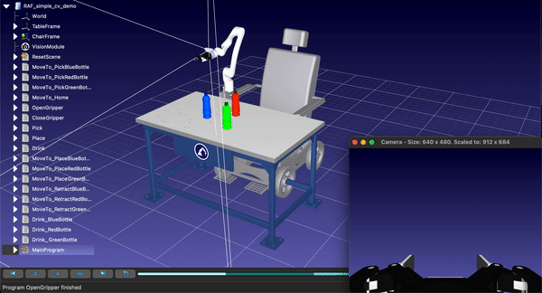
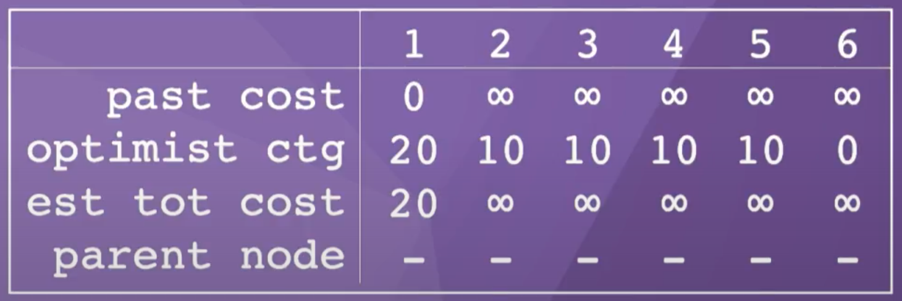
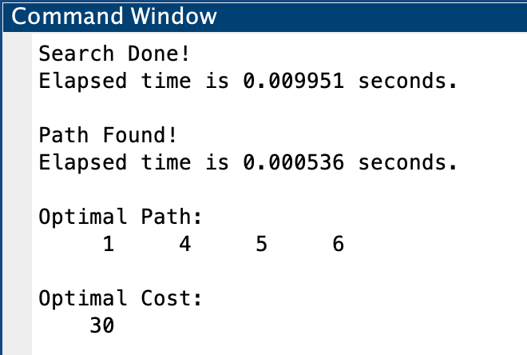
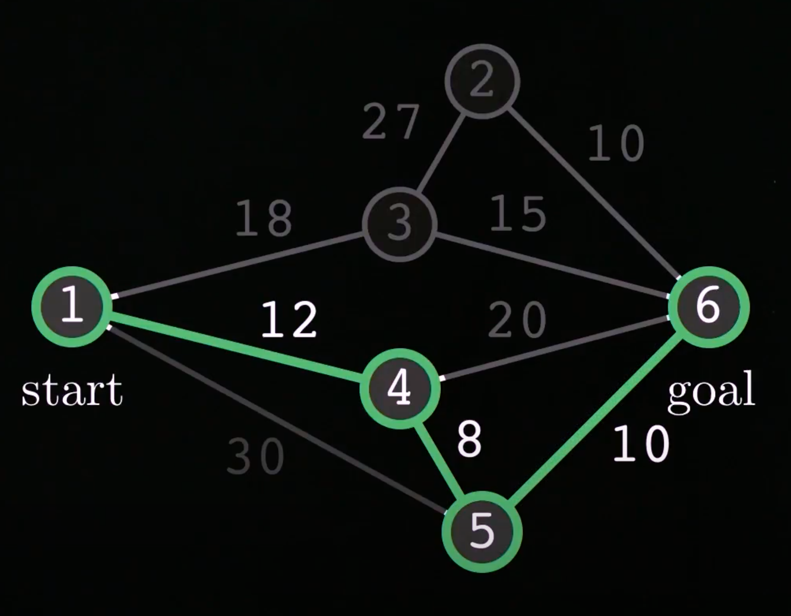

<p>
    <a id="TOP"></a>
    This page is part of a larger series on Path Planning, where the corresponding github repository can be found <a href="https://github.com/jschultz299/Path-Planning" target="_blank">here</a>. This project specifically demonstrates the A* Graph Search algorithm in a small example, implemented in MATLAB. The corresponding sub-repository can be found <a href="https://github.com/jschultz299/Path-Planning/tree/main/A-Star" target="_blank">here</a>.
</p>

<p>
    <strong><u><font size="+3">Table Of Contents</font></u></strong>
</p>

<p>
    <ol>
        <li><a href="#Overview">Motion Planning Overview</a></li>
        <li><a href="#AstarGraphSearch">A* Graph Search</a></li>
        <li><a href="#Conclusion">Concluding Remarks</a></li>
    </ol>
</p>

<hr/>

<p>
    <a id="Overview"></a>
    <strong><u><font size="+3">Motion Planning Overview</font></u></strong>
</p>

<p>
    Motion Planning for robotics consists of moving a robot from a start state to a goal state while avoiding obstacles as well as obeying constraints such as joint and torque limits.
</p>

<p align="center">
    
</p>

<p>
    Path Planning is a subset of the larger field of Motion Planning. Path planning consists of finding the geometric path that connects a start state to a goal state, while avoiding obstacles. In path planning, however, we ignore robot dynamics and additional environmental and motion constraints.
</p>

<p align="center">
    
</p>

<p>
    In this project, we will be exploring the A* Graph Search Algorithm for path planning. If you're interested in other projects in this Path Planning series, check out my page on <a href="https://jschultz299.github.io/portfolio/rrt">Rapidly Exploring Random Trees</a>.
</p>

<hr/>

<p>
    <a id="AstarGraphSearch"></a>
    <strong><u><font size="+3">A* Graph Search</font></u></strong>
</p>

<p>
    A* is one of the most common and efficient graph search algorithms. It finds the optimal path from a start node to a goal node, connecting intermediate nodes via edges.
</p>

<p>
    In this code, I have implemented the A* algorithm on the example Kevin Lynch presents in his video on Path Planning <a href="https://youtu.be/ZI800-2jv38" target="_blank">here</a>.
</p>

<p>
    Below you can see the example graph, along with it's optimal path, shown in green.
</p>

<p align="center">
    
</p>

This is a weighted, undirectional graph. The graph consists of ```n = 6``` nodes. The start node is node #1 while the goal node is node #6. Some of the nodes are connected via edges such that there are multiple paths you can take to reach the goal node from the start node.

<p>
    Each edge also contains an associated cost. This can be thought of as the effort required to take that path, or perhaps the distance between nodes, though then this graph is not shown to scale.
</p>

Here we can see that the optimal path is to start at node #1, travel to node #4, through node #5, and finally to the goal node, node #6. If we sum up the cost associated with each path, we get a ```cost = 30```. Therefore, the optimal path is ```1-4-5-6```.

<p>
    But how to we find this optimal path? That's where the A* algorithm comes in handy. I've implemented the solution in the matlab script <a href="https://github.com/jschultz299/Path-Planning/blob/main/A-Star/aStar.m" target="_blank">Astar.m</a>.
</p>

The first step is to recreate the nodes and associated costs in a matrix. Because there are 6 total nodes, our matrix will be a ```6x6``` matrix, where each element in the matrix is the cost associated with travelling along the path between the nodes ```i``` and ```j```. In an undirectional graph, it does not matter which direction you travel between nodes, so there will be duplicate costs in our matrix. This is okay, the A* search algorithm can handle this.

<p>
    Here's what the cost matrix looks like for this example:
</p>

```matlab
cost = [ 0  0 18 12 30  0 ;
         0  0 27  0  0 10 ;
        18 27  0  0  0 15 ;
        12  0  0  0  8 20 ;
        30  0  0  8  0 10 ;
         0 10 15 20 10  0 ];
```

Next, we initialize 4 ```1xn``` vectors, where the ```nth``` column corresponds to the node:
<ol>
    <li><strong>Past Cost</strong> - cost of previous best known path through each node</li>
    <li><strong>Optimistic Cost to Go</strong> - lower bound on the actual cost to go from a node to a goal node</li>
    <li><strong>Estimated Total Cost</strong> - sum of Past Cost and Optimistic Cost to Go</li>
    <li><strong>Parent Node</strong> - previous node on best known path for each node</li>
</ol>

For the ```past_cost```, the cost to travel from node #1 to itself is ```0```, whereas we initialize the rest to be ```inf```. 

For the ```optimist_ctg```, we want to choose values that are close to the actual cost to go, but serve as a lower bound. In this case, we will estimate the straight line distance from each node to the goal node. In a real problem, this may be measured. For this reason, we will estimate the ```optimist_ctg``` for node #1 to be ```20```, ```10``` for nodes #2-5, and ```0``` for node #6, because it is the goal node.

For the ```est_tot_cost```, we simply sum the ```past_cost``` and the ```optimist_ctg```.

Finally, for the ```parent_node```, we initialize all the nodes to ```0```.

Here is a summary table of our intial lists:

<p align="center">
    
</p>

We also need an ```OPEN``` list and a ```CLOSED``` list. These will tell the A* algorithm which node to search next, and when we can be finished searching a particular node. To start, we add the ```start_node``` to the ```OPEN``` list and leave the ```CLOSED``` list empty.

To iteratively step through the A* search algorithm for this example, feel free to follow along with Kevin's video [here](https://youtu.be/ZI800-2jv38), or set breakpoints in the <a href="https://github.com/jschultz299/Path-Planning/blob/main/A-Star/aStar.m" target="_blank">Astar.m</a> script.

Here is the section of the code that runs the actual A* algorithm:

```matlab
% Start A* Graph Search
while isempty(open_node) == false
    search_node = open_node(1);
    if search_node == goal_node
        disp('Search Done!')
        break
    end
    for i = 1:num_nodes
        if cost(search_node,i) ~= 0
            current_node = i;
            current_cost = cost(search_node,i) + past_cost(1,search_node);
            if current_cost < past_cost(1, current_node)
                parent_node(1,i) = search_node;
                past_cost(1,i) = cost(parent_node(1,i),i) + past_cost(1,parent_node(1,i));
                est_tot_cost = past_cost + optimist_ctg;
                % If search node is already in open_node list, replace it
                if ismember(current_node, open_node) == true
                    idx = find(open_node==current_node);
                    open_node(idx) = [];
                    open_cost(idx) = [];
                end
                open_node = [open_node, current_node];
                open_cost = [open_cost, est_tot_cost(1,current_node)];
                % Sort open list by ascending cost
                [open_cost, I] = sort(open_cost);
                open_node = open_node(I);
            end
        end
    end
    % Find and move search node from open to closed list
    idx = find(open_node==search_node);
    closed_node = [closed_node, open_node(idx)];
    open_node(idx) = [];
    open_cost(idx) = [];
end
```
While the ```OPEN``` list contains nodes, we loop through our cost matrix, comparing the costs between nodes to previously computed costs. If ```current_cost < past_cost```, then we update our information and continue the search, otherwise, it is not an optimal path and we skip it. The algorithm terminates if we search all possible paths, the first node in the ```OPEN``` list is the goal node, or the ```OPEN``` list is empty.

Once the A* algorithm finds an optimal path, we can reconstruct this path by stepping back through the ```parent_node``` list. We can also sum the costs as we go to compute the ```Optimal Cost```. Here is the final section of the code that achieves this:

```matlab
% After search is finished, reconstruct the optimal path
optimal_path = zeros(1,num_nodes);
optimal_path(1,end) = goal_node;
optimal_cost = 0;
tic
for i = num_nodes-1:-1:1
    optimal_path(1,i) = parent_node(optimal_path(1,i+1));
    optimal_cost = optimal_cost + cost(optimal_path(1,i), optimal_path(1,i+1));
    if optimal_path(1,i) == 1
        disp('Path Found!')
        optimal_path(optimal_path==0) = [];
        break
    end
end
```
Finally, let's display the ```Optimal Path``` and the ```Optimal Cost```.

```matlab
disp('Optimal Path: ')
disp(optimal_path)
disp('Optimal Cost: ')
disp(optimal_cost)
```
This should be the output if you've implemented the code correctly:

<p align="center">
    
</p>

If we compare this to what we computed previously, this is the optimal solution.

<p align="center">
    
</p>

Optimal Path: ```1-4-5-6```
<br>
Optimal Cost: ```30```

So congratulations! Our A* search algorithm found the optimal path in less than ```0.01``` seconds!

<hr/>

<p>
    <a id="Conclusion"></a>
    <strong><u><font size="+3">Concluding Remarks</font></u></strong>
</p>

The A* graph search algorithm is one of the most efficient and popular approaches to path planning. In practice, however, sometimes we do not know the environment exactly, or we cannot model it precisely. In this case, we need other methods to solve the path planning problem. 

If you want to learn about a popular <em>sampling</em> path planning approach, check out my project on <a href="https://jschultz299.github.io/portfolio/rrt">Rapidly Exploring Random Trees</a>.

<p>
    <em>Much of the information here came from Kevin Lynch's book, <a href="http://hades.mech.northwestern.edu/images/7/7f/MR.pdf" target="_blank">Modern Robotics: Mechanics, Planning, and Control</a> as well as his corresponding YouTube series, found <a href="https://www.youtube.com/playlist?list=PLggLP4f-rq02vX0OQQ5vrCxbJrzamYDfx" target="_blank">here</a>.</em>
</p>

<hr/>

<p align="center">
    <em><a href="#TOP">Back to top</a></em>
</p>
