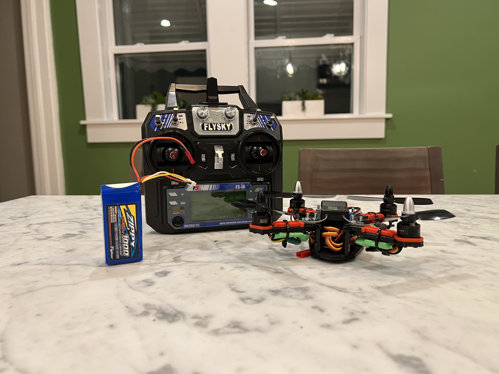

{% assign date = include.date | default: "today" | date: "%B %-d, %Y" %}
{% assign x = date | date: "%Y" | minus: 2016 %}

<!--  -->

    <em>*Disclaimer: This project was finished {{x}} years ago, thus a lot of the referenced components may be discontinued. Feel free to leave a comment and suggest alternatives!</em>

    Back in 2016, every kid wanted to build a drone, and I was no exeption. I wanted to learn how to 3D print, however, so I combined the two interests and set out to build a quadcopter with a 3D printed frame.

    The primary components you need for a quadcopter are:
    <ul>
        <li><a href="#Frame">Frame</a></li>
        <li><a href="#Motors">Motors</a></li>
        <li><a href="#ESC">Electronic Speed Controllers (ESC)</a></li>
        <li><a href="#FC">Flight Controller</a></li>
        <li><a href="#Battery">Battery</a></li>
        <li><a href="#PDB">Power Distribution Board (PDB)</a></li>
        <li><a href="#Propellor">Propellors</a></li>
        <li><a href="#RandR">Radio and Receiver</a></li>
    </ul>

    
    <strong><u>3D Printed Frame</u></strong>

    There are many standard quadcopter frames you can buy, but it's quite easy to design and 3D print your own! To design the frame, I used SolidWorks, but Autodesk's Fusion 360 is a great tool as well. When designing the parts, make sure to mark out where the motor holes need to be. Once I had the parts sketched out in SolidWorks, I printed them out. If you don't have access to a 3D printer, you can outsource your prints painlessly and cheaply using <a href="https://www.hubs.com/" target="_blank">Hubs</a>. You just have to keep in mind there is a delicate balance between durability and weight. The drone will inevitably crash, so it needs to hold up. On the other hand, the heavier it is, the more thrust it will require to get it off the ground, and thus more power. In any event, here are how the parts came out!



    
    <strong><u>Motors</u></strong>

    There are tons of quadcopter motors out there, and it can be a bit overwhelming to figure out which ones you need. However, there are many great resources and tutorials out there to help you get started. The motors I ended up using were two sets of <a href="https://hobbyking.com/en_us/dys-1306-3100kv-bx-series-set-of-two-cw-ccw-motors.html" target="_blank">DYS BX series 1306-3100KV </a> quadcopter motors. 

    
    <strong><u>Electronic Speed Controllers (ESC)</u></strong>

    An electronic speed controller's function is exactly that, to control the speed of the motors. The motors need to spin a certain speed according to how much you push on the throttle. They need to be programmed to produce the appropriate amount of thrust when needed, but we will talk about that more later. The ESCs I chose were the <a href="https://hobbyking.com/en_us/turnigy-multistar-10a-v2-esc-with-blheli-and-2a-lbec-2-3s-v.html" target="_blank">Turnigy Multistar 10A V2</a> with BLHeli pre-installed. 

    
    <strong><u>Flight Controller</u></strong>

    The flight controller is where the magic happens. This is what takes the commands issued by the pilot and tells the ESCs how much power to send the motors. Agian, there are many options available, but I ended up using a <a href="https://hobbyking.com/en_us/afroflight-naze32-rev6-flight-controller-acro.html" target="_blank">Naze32 Rev 6</a> flight controller. To program the flight controller, I used <a href="https://betaflight.com/" target="_blank"> BetaFlight Configurator</a>.

    
    <strong><u>Battery</u></strong>

    To power the quadcopter, we need a battery. Here again we must consider the tradeoff between power capacity and weight. The larger the battery, the more power it can produce (generally), but also the more it weighs. Lithium polymer batteries are a great solution because of their high power density and high discharge rate. However, Li-Po batteries can be dangerous when discharging at incorrect voltages so make sure to read all the directions, use protection circuits, and keep them properly charged! The batteries I used were the <a href="https://hobbyking.com/en_us/zippy-compact-1000mah-3s-25c-lipo-pack.html" target="_blank">Zippy 1000mAh 3S 25C Series</a> at 11.1v.

    
    <strong><u>Power Distribution Board</u></strong>

    To distribute power evenly from the battery to the ESCs and in turn, the motors, a power distribution board is recommended. The board I went with was the <a href="https://hobbyking.com/en_us/pdb-xt60-w-bec-5v-12v.html" target="_blank">Matek PDB-XT60</a> which has both 5v and 12v outputs.

    
    <strong><u>Propellors</u></strong>

    Now what would a quadcopter be without propellors! There are many different styles and shapes of propellors out there. It's good to do some research to find out which propellors are best for your drone. A link to some propellors can be found <a href="https://hobbyking.com/en_us/aircraft/drones/propellers.html" target="_blank">here</a>.

    
    <strong><u>Radio and Receiver</u></strong>

    

    In order for the pilot to communicate decisions to the quadcopter, a radio and receiver is required. There are tons and tons of different setups out there, but the one I went with was the <a href="https://usa.banggood.com/FlySky-FS-i6-2_4G-6CH-AFHDS-RC-Radio-Transmitter-With-FS-iA6B-Receiver-for-RC-FPV-Drone-Engineering-Vehicle-Boat-Robot-p-983537.html?imageAb=1&akmClientCountry=America&a=1663244138.7545&akmClientCountry=America&cur_warehouse=CN&ID=42482" target="_blank">FlySky Fs-i6 with iA6B receiver</a> as it is relatively inexpensive.

    <strong><u>Assembly</u></strong>

    Once you have all the components listed above, you can start putting it all together! Below you can see what the drone might look like with the lower and upper components mostly assembled.



    And that's it for the components! Here is a beauty shot of the finished product.

    

    <strong><u>Programming</u></strong>

    Just building the drone isn't enough, though. We want to get this thing off the ground! To do this, we need to program the flight controller and get the quadcopter set up and ready to fly. The software I use is <a href="https://betaflight.com/" target="_blank"> BetaFlight Configurator</a>. There are lots of great tutorials to help you get started. The biggest thing to rememeber is to flash the firmware that is appropriate for your flight controller. Once you have that done, you can use BetaFlight to calibrate your accelerometer, tune parameters like throttle response curves, program bailout macros, etc. It's then just a matter of figuring out what setups you like best! 

 

    And that's about it! Feel free to reach out in the comments below with any thoughts or comments. I'd love to see what anyone else has built as well!

    
<strong>Happy Flying!</strong>

<!--  -->
<!--  -->

    

    <em>This project was heavily inspired by <a href="https://www.instructables.com/How-to-Design-and-3D-Print-Your-Very-Own-Quadcopte/" target="_blank">this instructable</a> from <a href="https://www.instructables.com/member/tahitianrider/" target="_blank">tahitianrider</a>. Thanks to him for getting me started!</em>

