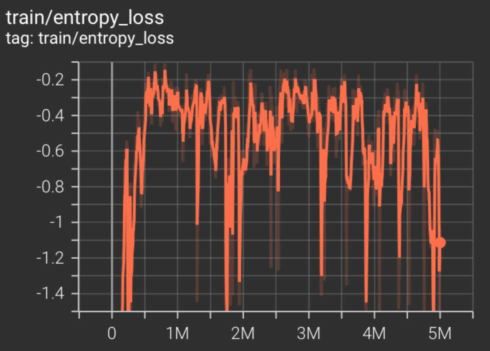

<!--  -->

<p>
    This page encompasses multiple demonstrations of Reinforcement Learning, both from a theoretical perspective and with an emphasis on implementation. The corresponding github repository can be found <a href="https://github.com/jschultz299/ReinforcementLearning" target="_blank">here</a>.
</p>

<p>
    <a id="TOC"></a>
    <strong><u><font size="+3">Table Of Contents</font></u></strong>
</p>

<p>
    <ol>
        <li><a href="#Overview">Overview</a></li>
        <li><a href="#GridWorld">GridWorld</a></li>
        <ol type="a">
            <li><a href="#RandomActions">Random Actions</a></li>
            <li><a href="#ValueIteration">Value Iteration</a></li>
            <li><a href="#Q-Learning">Epsilon Greedy Q-Learning</a></li>
        </ol>
        <li><a href="#OpenAiGym">OpenAI Gym</a>
            <ol type="a">
                <li><a href="#Pendulum">Inverted Pendulum</a></li>
                <li><a href="#Breakout">Breakout</a></li>
                <li><a href="#SelfDriving">Self Driving</a></li>
                <li><a href="#Mario">Super Mario Bros.</a></li>
            </ol>
        </li>
        <li><a href="#Conclusion">Concluding Remarks</a></li>
    </ol>
</p>

<hr/>

<p>
    <a id="Overview"></a>
    <strong><u><font size="+3">Overview</font></u></strong>
</p>

<p>
    Reinforcement Learning (RL) is a branch of machine learning that can be used to learn appropriate strategies for completing a task in an environment. The typical RL workflow consists of an agent and an environment. The agent is allowed to take defined actions (discrete or continuous) based on a policy. Based on these actions, the state of the environment changes. The agent is rewarded when its actions result in environment states which are favorable. These rewards can in turn inform the model which actions are appropriate according to the current state of the agent and the environment. 
</p>

<p>
    There are two main projects on this page. The first is <a href="#GridWorld">GridWorld</a>, which explores fundamental reinforcement learning concepts. The second is various <a href="#OpenAiGym">OpenAi Gym</a> environments meant to display how reinforcement learning can be used in some fun ways!
</p>

<hr/>

<p>
    <a id="GridWorld"></a>
    <strong><u><font size="+3">GridWorld</font></u></strong>
</p>

<p>
    To better understand the basic concepts of Reinforcement Learning, I created a demonstration based on work from the <a href="http://ai.berkeley.edu/reinforcement.html" target="_blank">UC Berkely AI Program</a>, showing how fundamental RL techniques can be deployed to solve a simple navigation task.
</p>

<p>
    The goal of the project is to have the agent explore the GridWorld environment and to learn how best to reach the green space. The agent is rewarded when it reaches the green space, and penalized when it lands in the red space. It is also penalized slightly for each action it performs, to incentive reaching the green space in as few moves as possible.

    The agent has the option of four actions:
</p>

<ul>
    <li>Move left</li>
    <li>Move right</li>
    <li>Move up</li>
    <li>Move down</li>
</ul>

<p>
    The GridWorld project was implemented in Matlab. The code for the project can be found <a href="https://github.com/jschultz299/ReinforcementLearning/tree/main/GridWorld" target="_blank">here</a>. The main script is called <em>run.m</em>
</p>

<p>
    <a id="RandomActions"></a>
    <strong><font size="+2">a) Random Actions</font></strong>
</p>

<p>
    The first section of the code renders the GridWorld environment and demonstrate one episode with random actions. The environment is comprised of 12 spaces, arranged in a 3x4 grid. In this first example, the agent randomly selects an action until it reaches a goal space (either green or red). The states of the environment spaces will be updated as the agent progresses. More positive states (green) indicate a higher probability of choosing the associated action, whereas more negative states (red) indicate a lower probability of choosing the associated action.
</p>

<p align="center">
    
</p>

<p>
    <a id="ValueIteration"></a>
    <strong><font size="+2">b) Value Iteration</font></strong>
</p>

<p>
    The next section of the code runs many iterations of the agent performing actions according to a basic policy, updating the environment space Q-values as it progresses.Below you can see the comparison between the first 100 and 1000 iterations.
</p>

<p align="center">
    
</p>

<p>
    <a id="Q-Learning"></a>
    <strong><font size="+2">c) Epsilon Greedy Q-Learning</font></strong>
</p>

<p>
    The final section of the code runs many iterations of the agent performing actions according to the current policy, while implementing Epsilong Greedy Q-learning. The value of epsilon can be manipulated to vary the agent's incentive to explore the space vs exploit the policy. Below you can see the comparison between the first 1000 and 5000 iterations with epsilon = 0.2.
</p>

<p align="center">
    
</p>

<p>
    By comparing the results of section b and section c, we notice that by training with Epsilon Greedy Q-learning, the agent has learned to avoid the bottom sections of the environment.
</p>

<p align="center">
    <em><a href="#TOC">Back to top</a></em>
</p>

<hr/>

<p>
    <a id="OpenAiGym"></a>
    <strong><u><font size="+3">OpenAi Gym</font></u></strong>
</p>

<p>
    The previous <a href="#GridWorld">GridWorld</a> demonstration works well for a relatively simple, properly defined environment with a discrete set of available actions. Oftentimes, the problem we are interested in solving is much more complicated. Because of the additional environmental complexities (input dimensionality) and agent actions (continuous), finding an optimal policy can become difficult or impossible. One possible solution is to use Deep Reinforcement Learning (deepRL). Rather than randomly explore the entire environment to determine the optimal policy, we can use deep neural networks (DNNs) to learn the optimal policy without evaluating every state-action pair. In this way, the DNN functions as a <em>dimensionality reducer</em> and allows complex problems to be solved more easily.
</p>

<p>
    To understand how to apply Deep Reinforcement Learning to more complex problems, I completed 4 demonstrations showcasing deepRL using <a href="https://www.gymlibrary.dev/" target="_blank">OpenAIGym</a>. All the code for this project can be found it the corresponding github repository <a href="https://github.com/jschultz299/ReinforcementLearning/tree/main/OpenAiGym" target="_blank">here</a>.
</p>

<p>
    <a id="Pendulum"></a>
    <strong><font size="+2">a) Inverted Pendulum</font></strong>
</p>

<p>
    This project uses the <a href="https://www.gymlibrary.dev/environments/classic_control/cart_pole/" target=_blank>CartPole</a> environment. The goal of the project is the train the agent to learn how to balance the pendulum upright for an extended period of time. The agent is rewarded if the pendulum remains upright within a certain range of joint angles.
</p>

<p>
    To run the program:
</p>

```python Pendulum.py```

<p>
    Below you can see a demonstration of the agent performing random actions for 5 episodes.
</p>

<p align="center">
    
</p>

<p>
    Here is the section of the code that creates this demo:
</p>

```python
environment_name = "CartPole-v0"
env = gym.make(environment_name)

episodes = 5
for episode in range(1, episodes+1):
  state = env.reset()
  done = False
  score = 0

  while not done:
    env.render()
    action = env.action_space.sample()
    n_state, reward, done, info = env.step(action)
    score+=reward
  print('Episode:{} Score:{}'.format(episode, score))
env.close()
```

<p>
    Training a PPO model with 20,000 timesteps...
</p>

```python
stop_callback = StopTrainingOnRewardThreshold(reward_threshold=200, verbose=1)
eval_callback = EvalCallback(env,
                            callback_on_new_best=stop_callback,
                            eval_freq=10000,
                            best_model_save_path=save_path,
                            verbose=1)
model = PPO('MlpPolicy', env, verbose=1, tensorboard_log=log_path)
model.learn(total_timesteps=20000, callback=eval_callback)
```

<p>
    ... is is sufficient for the agent to learn how to balance the pendulum, shown below. We can see that the pendulum is much more stable for a longer period of time.
</p>

<p align="center">
    
</p>

<p>
Check out the tensorboard logs for PPO model trained with 20k timesteps <a href="https://github.com/jschultz299/ReinforcementLearning/tree/main/OpenAiGym/Images/Pendulum/Tensorboard%20Logs" target="_blank">here</a>.
</p>

<p>
    <a id="Breakout"></a>
    <strong><font size="+2">b) Breakout</font></strong>
</p>

<p>
    This project uses the <a href="https://www.gymlibrary.dev/environments/atari/breakout/" target=_blank>Breakout</a> environment. The goal of the project is to play the classic Atari brick breaking game called <em>Breakout</em>. The agent is rewarded for each brick it breaks, and penalized for losing lives.
</p>

<p>
    To run the program:
</p>

```python Pendulum.py```

<p>
    Below you can see a demonstration of the agent playing Breakout with random actions.
</p>

<p align="center">
    
</p>

<p>
    Here is the section of the code that creates this demo:
</p>

```python
environment_name = 'Breakout-v0'
env = gym.make(environment_name)

episodes = 5
for episode in range(1, episodes+1):
    obs = env.reset()
    done = False
    score = 0
    
    while not done:
        env.render()
        action = env.action_space.sample()
        obs, reward, done, info = env.step(action)
        score+=reward
    print('Episode:{} Score:{}'.format(episode, score))
env.close()
```

<p>
    Stacking 4 environments together and training an A2C model on the stack with 2 million timesteps...
</p>

```python
env = make_atari_env(environment_name, n_envs=4, seed=0)
env = VecFrameStack(env, n_stack=4)

log_path = os.path.join('Training', 'Logs')
model = A2C('CnnPolicy', env, verbose=1, tensorboard_log=log_path)

model.learn(total_timesteps=2000000)
```

<p>
    ... results in an average reward of approximately 23 bricks broken per game, shown below. Training for significantly longer might improve performance.
</p>

<p align="center">
    
</p>

<p>
Check out the logs for an A2C model trained with 100k timesteps <a href="https://github.com/jschultz299/ReinforcementLearning/tree/main/OpenAiGym/Images/Breakout/Tensorboard_Logs" target="_blank">here</a>.
</p>

<p>
    <a id="SelfDriving"></a>
    <strong><font size="+2">c) Self Driving</font></strong>
</p>

<p>
    This project uses the <a href="https://www.gymlibrary.dev/environments/box2d/car_racing/" target=_blank>Car Racing</a> environment. The goal of this project is for the agent (the car) to drive along the track for as long as possible. The agent receives rewards for remaining on the track, and is penalized for leaving the track as well as penalized slightly for each timestep. The actions the agent may take are the direction to turn the wheels as well as acceleration and braking. All of the actions are in the continuous space. The track is considered solved if the agent receives a total score of 900.
</p>

<p>
    To run the program:
</p>

```python SelfDriving.py```

<p>
    Below you can see a demonstration of the agent driving along the track with random inputs.
</p>

<p align="center">
    
</p>

<p>
    Here is the section of the code that creates this demo:
</p>

```python
environment_name = 'CarRacing-v0'
env = gym.make(environment_name)

episodes = 2
for episode in range(1, episodes+1):
    obs = env.reset()
    done = False
    score = 0

    while not done:
        env.render()
        action = env.action_space.sample()
        obs, reward, done, info = env.step(action)
        score+=reward
    print('Episode:{} Score:{}'.format(episode, score))
env.close()
```

<p>
    Training a PPO model with just 10,000 timesteps...
</p>

```python
env = gym.make(environment_name)
env = DummyVecEnv([lambda: env])

log_path = os.path.join('Training', 'Logs')
model = PPO('CnnPolicy', env, verbose=1, tensorboard_log=log_path)

model.learn(total_timesteps=10000)
```

<p>
    ... results in an agent with poor performance, shown below.
</p>

<p align="center">
    
</p>

<p>
    This model achieved an average score of -40.6.
</p>

<p>
Check out the tensorboard logs for the PPO model trained with 10k timesteps <a href="https://github.com/jschultz299/ReinforcementLearning/tree/main/OpenAiGym/Images/SelfDriving/Tensorboard_Logs/10k_Model" target="_blank">here</a>.
</p>

<p>
    Training the model for more timesteps, this time 200,000...
</p>

```python
model = PPO('CnnPolicy', env, verbose=1, tensorboard_log=log_path)
model.learn(total_timesteps=200000)
```
<p>
    ... results in an agent with much better performance, shown below.
</p>

<p align="center">
    
</p>

<p>
    This model achieved an average score of 436.2, and was even able to fully solve the track on occasion.
</p>

<p>
Check out the tensorboard logs for the PPO model trained with 10k timesteps <a href="https://github.com/jschultz299/ReinforcementLearning/tree/main/OpenAiGym/Images/SelfDriving/Tensorboard_Logs/200k_Model" target="_blank">here</a>.
</p>

<p>
    Because the actions are continuous, the model has a hard time learning the appropriate actions to take. It is possible that training for longer might result in better performance. <a href="https://github.com/NotAnyMike" target="_blank">NotAnyMike</a> tried adjusting the action space to only use discrete inputs, which simplified the problem somewhat. Check out his solution <a href="https://notanymike.github.io/Solving-CarRacing/" target="_blank">here</a>.
</p>

<p>
    <a id="Mario"></a>
    <strong><font size="+2">d) Super Mario Bros.</font></strong>
</p>

<p>
    This project uses the <a href="https://pypi.org/project/gym-super-mario-bros/" target=_blank>SuperMarioBros</a> environment wrapper. The goal of the project is the train the agent to learn how to play Super Mario Bros. The agent is rewarded for moving to the right and for reaching the flag. The agent is penalized for how much time it takes to reach the flag and for deaths.
</p>

<p>
    Mario has a number of actions he can take, which correspond to the input buttons on a game controller. There are three different <a href="https://github.com/Kautenja/gym-super-mario-bros/blob/master/gym_super_mario_bros/actions.py" target="_blank">action spaces</a> with varying levels of complexity. In this project, the "Simple Movement" action space is used. Here are the different movement options:
</p>

```python
SIMPLE_MOVEMENT = [
    ['NOOP'],
    ['right'],
    ['right', 'A'],
    ['right', 'B'],
    ['right', 'A', 'B'],
    ['A'],
    ['left'],
]
```

<p>
    To run the program:
</p>

```python SuperMarioBros.py```

<p>
    Below you can see a demonstration of the agent playing Super Mario Bros. with random actions.
</p>

<p align="center">
    
</p>

<p>
    Here is the section of the code that creates this demo:
</p>

```python
environment_name = 'SuperMarioBros-v0'
env = gym_super_mario_bros.make(environment_name)
env = JoypadSpace(env, SIMPLE_MOVEMENT)

done = True
frames = 3000
for step in range(frames):
    if done:
        env.reset()
    state, reward, done, info = env.step(env.action_space.sample())
    env.render()
env.close()
```

<p>
    We can notice that mario gets stuck behind the first pipe. That's because the agent is just making random actions. In contrast to our other previous projects, this one has a much more important <em>time dependency</em>. It not only matters when a certain input is executed, but also for how long that input is held. For example, to successfully clear a pipe, the jump input command needs to be maintained for multiple frames.
</p>

<p>
    This is where frame stacking can give us an advantage. In this environment, we can stack frames on top of each other to give the agent a sense of 'memory'. In this case, we not only tell the agent to pay attention to the current frame, but also the previous 7 frames as well. Below you can see an image of the stacked frames. This should help the agent to learn to actions that span multiple frames as well. <em>We actually did that in the <a href="#Breakout">Breakout</a> project as well, but I think it is more interesting to see it here.</em>
</p>

<p align="center">
    
</p>

<p>
    Training the model for a whopping 5,00,000 timesteps...
</p>

```python
env = DummyVecEnv([lambda: env])
env = VecFrameStack(env, 8, channels_order='last')

class TrainAndLoggingCallback(BaseCallback):
    def __init__(self, check_freq, save_path, verbose=1):
        super(TrainAndLoggingCallback, self).__init__(verbose)
        self.check_freq = check_freq
        self.save_path = save_path
        
    def _init_callback(self):
        if self.save_path is not None:
            os.makedirs(self.save_path, exist_ok=True)
            
    def _on_step(self):
        if self.n_calls % self.check_freq == 0:
            model_path = os.path.join(self.save_path, 'best_model_{}'.format(self.n_calls))
            self.model.save(model_path)
        return True
        
CHECKPOINT_DIR = './train'
LOG_DIR = '.logs'

callback = TrainAndLoggingCallback(check_freq=10000, save_path=CHECKPOINT_DIR)

model = PPO('CnnPolicy', env, verbose=1, tensorboard_log=LOG_DIR, learning_rate=.000001, n_steps=512)
model.learn(total_timesteps=1000, callback=callback)
```

<p>
    ... results in an agent with decent, yet not near perfect performance.
</p>

<p align="center">
    
</p>

<p>
Check out the logs for a PPO model trained with 5M timesteps <a href="https://github.com/jschultz299/ReinforcementLearning/tree/main/OpenAiGym/Images/SuperMario/Tensorboard_Logs/5M_Model" target="_blank">here</a>.
</p>

<p>
    Even after training for 5 million timesteps for over 20 hours on an NVIDIA 3090 GPU, the agent was only able to beat the first level of Super Mario Bros. one time. If we take a look at the tensorboard logs, we can see that the entropy loss never really converges. In fact, it's not even clear that there is a downward trend. This may be evidence that the model isn't learning fast enough, and may never learn how to successfully play the game, at least not in the current setup. See the entropy loss below.
</p>

<p align="center">
    
</p>

<p>
    Some things to try would be to increase the number of frames in the stack, allowing the model to learn across more frames, however, this would significantly increase training time. Another thing to try is to adjust the penalties and rewards. Right now, the agent is only rewarded for reaching the flag. It's possible that giving the agent more frequent rewards, for squashing an enemy, for example, might help the model to learn better. Most likely, however, the cause is that the model is not complex enough to handle the input information. Of all of our exercises on this page, this one is the most complicated. The input space is the largest, the inputs are time dependent, and image frame changes greatly depending on where you are in the level. A more complex model might be able to learn more given the information available in the problem. Feel free to leave a comment down below if you have any other thougths or want to share your solution!
</p>

<p align="center">
    <em><a href="#TOC">Back to top</a></em>
</p>

<hr/>

<p>
    <a id="Conclusion"></a>
    <strong><u><font size="+3">Concluding Remarks</font></u></strong>
</p>

<p>
    So that's it! Thanks for making it to the end of this post on Reinforcement Learning. There are tons of other environments to play around with through <a href="https://www.gymlibrary.dev/" target="_blank">OpenAiGym</a> and I would encourage anyone reading this to go check them out on your own. Reinforcement Learning is an emerging field in Machine Learning and there is new and exciting research being published all the time on how to make agents learn faster and more efficiently. I'd love to hear what others think about Reinforcement Learning or Machine Learning in general. Please let me know in the comments your thoughts on these projects or any RL projects others have done!
</p>

<p>
    <center><strong><font size="+5">Happy Learning!</font></strong></center>
</p>



<p align="center">
    <em><a href="#TOC">Back to top</a></em>
</p>

<hr/>

<p>
    <em>This project was inspired by the <a href="https://www.youtube.com/watch?v=Mut_u40Sqz4" target="_blank">Reinforcement Learning in 3 Hours</a> course from <a href="https://www.youtube.com/c/NicholasRenotte" target="_blank">Nicholas Renotte</a> on YouTube. Thanks to him for helping me get started! You can check out his code for these projects as well <a href="https://github.com/nicknochnack/ReinforcementLearningCourse" target="_blank">here</a>.</em>
</p>