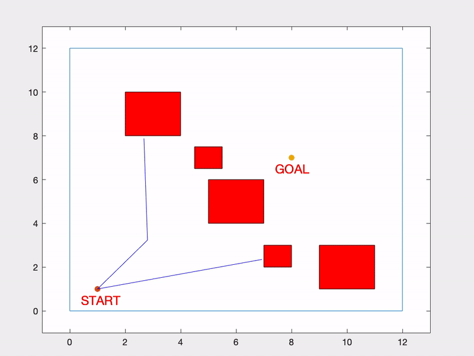
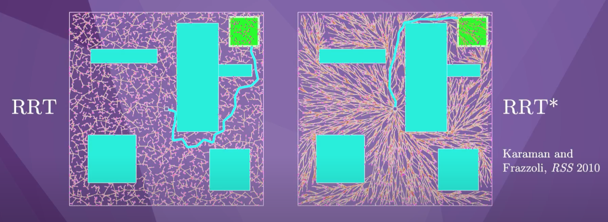

<p>
    <a id="TOP"></a>
    This page is part of a larger series on Path Planning, where the corresponding github repository can be found <a href="https://github.com/jschultz299/Path-Planning" target="_blank">here</a>. This project specifically demonstrates using Rapidly Exploring Random Trees in a small example, implemented in MATLAB. The corresponding sub-repository can be found <a href="https://github.com/jschultz299/Path-Planning/tree/main/Rapidly-Exploring-Random-Trees" target="_blank">here</a>.
</p>

<p>
    <strong><u><font size="+3">Table Of Contents</font></u></strong>
</p>

<p>
    <ol>
        <li><a href="#Overview">Motion Planning Overview</a></li>
        <li><a href="#Setup">Environment Setup</a></li>
        <li><a href="#RRT">RRT Search</a></li>
        <li><a href="#Heart">Fun Surprise!</a></li>
        <li><a href="#Conclusion">Concluding Remarks</a></li>
    </ol>
</p>

<hr/>

<p>
    <a id="Overview"></a>
    <strong><u><font size="+3">Motion Planning Overview</font></u></strong>
</p>

<p>
    Motion Planning for robotics consists of moving a robot from a start state to a goal state while avoiding obstacles as well as obeying constraints such as joint and torque limits.
</p>

<p align="center">
    
</p>

<p>
    Path Planning is a subset of the larger field of Motion Planning. Path planning consists of finding the geometric path that connects a start state to a goal state, while avoiding obstacles. In path planning, however, we ignore robot dynamics and additional environmental and motion constraints.
</p>

<p align="center">
    
</p>

<p>
    In this project, we will be exploring Rapidly Exploring Random Trees for path planning. If you're interested in other projects in this Path Planning series, check out my page on <a href="https://jschultz299.github.io/portfolio/astar">A* Search Algorithm</a>.
</p>

<p align="center">
    <em><a href="#TOP">Back to top</a></em>
</p>

<hr/>

<p>
    <a id="Setup"></a>
    <strong><u><font size="+3">Environment Setup</font></u></strong>
</p>

Much like in the <a href="https://github.com/jschultz299/Path-Planning/tree/main/A-Star" target="_blank">A* Search Algorithm</a>, we begin by creating an environment with a ```START``` node, a ```GOAL``` node, as well as ```OBSTACLES```.

Here is what our example environment will look like:

<p align="center">
    
</p>

<p>
    And here is the section of the code that creates and plots this environment:
</p>

```matlab
OB = [0 0; 12 0; 12 12; 0 12; 0 0];
qs = [1 1];
qg = [8 7];

figure
plot(OB(:,1),OB(:,2))
hold on
plot(qs(1), qs(2), '.', 'MarkerSize', 20)
text(qs(1)-0.6,qs(2)-0.5,'START','Color','red','FontSize',14)
plot(qg(1), qg(2), '.', 'MarkerSize', 20)
text(qg(1)-0.6,qg(2)-0.5,'GOAL','Color','red','FontSize',14)
axis([-1 13 -1 13])

obstacle = [5 4; 7 4; 7 6; 5 6; 5 4];
obstacle2 = [4.5 6.5; 5.5 6.5; 5.5 7.5; 4.5 7.5; 4.5 6.5];
obstacle3 = [2 8; 4 8; 4 10; 2 10; 2 8];
obstacle4 = [9 1; 11 1; 11 3; 9 3; 9 1];
obstacle5 = [7 2; 8 2; 8 3; 7 3; 7 2];

fill(obstacle(:,1), obstacle(:,2),'r')
fill(obstacle2(:,1), obstacle2(:,2),'r')
fill(obstacle3(:,1), obstacle3(:,2),'r')
fill(obstacle4(:,1), obstacle4(:,2),'r')
fill(obstacle5(:,1), obstacle5(:,2),'r')
```

You can easily change the positions of the ```START``` and ```GOAL``` nodes as well as the number and positions of the ```OBSTACLES``` here.

In general, the RRT algorithm has two goals:
1. Find a path from the ```START``` node to the ```END``` node
2. Explore the space

<p>
    Unlike the A* algorithm, the RRT does not guarantee the optimal path will be found. Instead, this is a sampling algorithm that will explore until a node is found within some radius of the goal node, or until a specified number of nodes have been searched.
</p>

In the code, we implement this with a ```while``` loop. Here, ```E``` is our search radius and in this case we've set it to ```0.2```. If we increase ```E```, it will be easier for the RRT algorithm to find a path planning solution, however it is likely the solution will not be as accurate. When a node is found within the specified radius to the ```GOAL``` node, the while loop will exit.

```matlab
while E > 0.2
    % Implement RRT algorithm here
end
```

As an added failsafe, we can add an additional exit criteria if the number of nodes exceeds a certain limit. We can do this by counting the number of iterations in the ```while``` loop and comparing it to the limit each time through the loop. In this case, we set our iteration limit to ```1000```. If this iteration limit is exceeded, we terminate the ```while``` loop.

```matlab
if i >= 1000
    warning('Too many iterations. Stopping here and plotting closest point.')
    plot(data.node(index_E,1), data.node(index_E,2), '*k', 'MarkerSize', 8)
    flag = 1;
    break
end
```

<p align="center">
    <em><a href="#TOP">Back to top</a></em>
</p>

<hr/>

<p>
    <a id="RRT"></a>
    <strong><u><font size="+3">RRT Search</font></u></strong>
</p>

Now we can begin the actual RRT search. First, we sample a point randomly within the workspace.

```matlab
data.node(i,:) = 12*rand(1,2);
```

We can modify the ```mean``` and ```standard deviation``` of the ```rand()``` function to manipulate the point sampling.

We then check the current tree and find the node that is the closest to the new node we have just sampled.

```matlab
% Find nearest parent node to new node
shortest_d = inf;
for ii = 1:1:size(data.node,1)
    d = sqrt((data.node(ii,1)-data.node(i,1))^2 + (data.node(ii,2)-data.node(i,2))^2);
    if d ~= 0 && d < shortest_d
        shortest_d = d;
        index_d = ii;
    end
end
```

We then need to make sure that no collisions are detected between the nearest parent node and the new sampled node.

```matlab
% Collision Detection
v = [linspace(data.node(data.parent(i),1), data.node(i,1), 50)', linspace(data.node(data.parent(i),2), data.node(i,2), 50)'];
for r = 1:1:length(v)
    [in, on] = inpolygon(v(r,1), v(r,2), obstacle(:,1),obstacle(:,2));
    [in2, on2] = inpolygon(v(r,1), v(r,2), obstacle2(:,1),obstacle2(:,2));
    [in3, on3] = inpolygon(v(r,1), v(r,2), obstacle3(:,1),obstacle3(:,2));
    [in4, on4] = inpolygon(v(r,1), v(r,2), obstacle4(:,1),obstacle4(:,2));
    [in5, on5] = inpolygon(v(r,1), v(r,2), obstacle5(:,1),obstacle5(:,2));
    if      in == 1 ||  on == 1 ...
        || in2 == 1 || on2 == 1 ...
        || in3 == 1 || on3 == 1 ...
        || in4 == 1 || on4 == 1 ...
        || in5 == 1 || on5 == 1

        data.node(i,:) = v(r-1,:);
        break
    end
end
```

If no collisions are detected, we can draw an edge between the two nodes.

```matlab
plot([data.node(index_d,1) data.node(i,1)], [data.node(index_d,2) data.node(i,2)], 'b')
```
To animate the plot, we can add a ```pause()``` command at this point in the loop to slow it down so we can view the search in progress.

```matlab
pause(.01)
```

Finally, we compute the distance between our newest node in the tree and the ```GOAL``` node. We also keep track of the shortest path here in case we don't find a solution within our search threshold ```E```. If we reach our iteration limit, we will return the best solution we've found so far.

```matlab
E = sqrt((qg(1)-data.node(i,1))^2 + (qg(2)-data.node(i,2))^2);
if E < shortest_E
    shortest_E = E;
    index_E = i;
end
```

We repeat this process until either of our two exit criteria are met.

Once our ```while``` exits and our RRT algoritm terminates, we need to reconstruct the shortest path between the ```START``` node and the ```GOAL``` node.

```matlab
% Plot the path to the node closest to the goal
j = index_E;
k = data.parent(index_E);

while k ~= 0
    plot([data.node(k,1) data.node(j,1)], [data.node(k,2) data.node(j,2)], 'k', 'LineWidth', 2)
    j = k;
    k = data.parent(j);
end
```

And that's it! Now we can sit back and watch the RRT algorithm do it's job.

<p align="center">
    
</p>

Here is another example with a more difficult environment configuration and the RRT algorithm handles it just fine.

<p align="center">
    
</p>

<p align="center">
    <em><a href="#TOP">Back to top</a></em>
</p>

<hr/>

<p>
    <a id="Heart"></a>
    <strong><u><font size="+3">Fun Surprise!</font></u></strong>
</p>

You can also have some fun with RRTs and draw pictures with them! Here's one I put together for Valentine's Day.

<p align="center">
    
</p>

<p align="center">
    <em><a href="#TOP">Back to top</a></em>
</p>

<hr/>

<p>
    <a id="Conclusion"></a>
    <strong><u><font size="+3">Concluding Remarks</font></u></strong>
</p>

Because of their relative simplicity and explorative nature, RRTs are a popular path planning sampling algorithm. They don't guarantee an optimal solution, however, there is an extension to the RRT algorithm called RRT* that does. This algorithm continuously updates the tree so that the solution trends toward the optimal solution as the number of nodes in the tree approaches infinity. Here's a side-by-side of the RRT and RRT* solutions on the same problem.

<p align="center">
    
</p>

Maybe in a future project I will modify my RRT implementation to include the RRT* algorithm so stay tuned for that.

If you missed my previous project implementing the A* Graph Search Algorithm, check it out <a href="https://jschultz299.github.io/portfolio/astar">here</a>!

<em>This RRT implementation in MATLAB was completed as part of the requirements for my graduate coursework in Dr. Eric Schearer's course: Intelligent Controls. For more information about RRTs and other robotics topics, check out Kevin Lynch's book, <a href="http://hades.mech.northwestern.edu/images/7/7f/MR.pdf" target="_blank">Modern Robotics: Mechanics, Planning, and Control</a> as well as his corresponding YouTube series, found <a href="https://www.youtube.com/playlist?list=PLggLP4f-rq02vX0OQQ5vrCxbJrzamYDfx" target="_blank">here</a>.</em>

<hr/>

<p align="center">
    <em><a href="#TOP">Back to top</a></em>
</p>