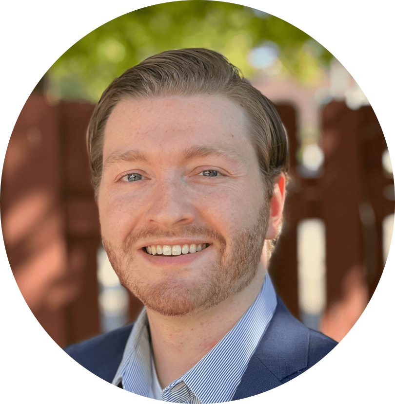

    

    Hi! My name is Jack Schultz. I have strong interests in robotics, mechatronics, controls, computer vision, motion planning, machine learning, and artificial intelligence. My long term 
    goal is to develop transformative technologies in the fields of robotics and machine learning which transition society to a world of abundance and empower humans to live productive and healthy lives.

 
    

    I recently earned my PhD in Mechanical Engineering from 
    <a href="https://www.csuohio.edu/" target="_blank">Cleveland State University</a>.
    In this role, I was a part of a group called the <a href="https://engineering.csuohio.edu/research/center-for-human-machine-systems" target="_blank">Center for Human Machine Systems</a>.  
    My PhD research project combined robotics, computer vision, and eye tracking 
    to enable individuals with spinal cord injuries to feed themselves. You can find information regarding this work and more on the <a href="https://jschultz299.github.io/portfolio/">Projects</a> page.

    Some key research projects I worked on during my time in academia include:

<ul>
  <li><strong><a href="https://jschultz299.github.io/portfolio/raf">Robot-Assisted Feeding for People with Spinal Cord Injuries</a></strong> [In Development]</li>
  <li><strong><a href="https://jschultz299.github.io/portfolio/rl">Deep Reinforcement Learning for Atari Games</a></strong></li>
  <li><strong>Eye-Hand Coordination in the Presence of Entangled Feedback</strong> [Coming Soon]</li>
  <li><strong><a href="https://jschultz299.github.io/portfolio/walker">SmartWalker Posture Monitor for Elderly Individuals</a></strong></li>
</ul>

Skills developed include:

<ul>
  <li><strong>Robotics / Machine Learning / Computer Vision / Motion Planning</strong></li>
  <li><strong>Machine Learning/ Deep Learning / Reinforcement Learning</strong></li>
  <li><strong>Python / C++ / MATLAB / SQL / HTML / QML</strong></li>
  <li><strong>ROS / Gazebo / Moveit</strong></li>
  <li><strong>PyTorch / TensorFlow</strong></li>
  <li><strong>Minitab / R / SPSS</strong></li>
  <li><strong>Fabrication / Rapid Prototyping / Additive Manufacturing</strong></li>
  <li><strong>SolidWorks / Fusion360</strong></li>
  <li><strong>Collaboration / Strategic Vision / Organization</strong></li>
  <li><strong>Creative Problem-Solving / Research / Data Analysis</strong></li>
  <li><strong>Project Management / Technical Writing / Organization</strong></li>
</ul>

    <strong><u>More About Me</u></strong>

    I'm originally from St. Louis, Missouri.
    I moved to Ohio in 2013 and earned my Bachelor's degree in Mechanical Engineering from the <a href="https://udayton.edu/" target="_blank">University of Dayton</a> in December 2017. I then moved to Cleveland, Ohio the following summer where I began working toward 
    earning my PhD in Mechanical Engineering at <a href="https://www.csuohio.edu/" target="_blank">Cleveland State University</a>. I recently completed my graduate degree and earned my PhD in May 2023. Although I've been in Ohio 
    for almost a decade, I still remain a huge Cardinals and Blues fan! I've slowly been converted into a Browns fan as well, which has taught me a lot about my pain tolerance &#128541;.

    I love playing sports such as broomball, lacrosse, golf, and spikeball, as well as other outdoor 
    activities including snowboarding, wakeboarding, hiking, and traveling. I also play electric guitar and enjoy 
    all the classic rock bands, especially Led Zeppelin, AC/DC, Jimi Hendrix, and Van Halen.

 
    My real passion, however, is learning. I love building things that combine both technology and creativity, learning 
    about new research ideas and fabrication techniques along the way. Whether it's casting aluminum 
    parts in a homeade foundry, tearing down and rebuilding an old dirtbike, or converting a gaming console into a 
    portable system, there is something to be learned from every experience. Check out some of these fun projects on the 
    <a href="http://jschultz299.github.io/portfolio/">Projects</a> page!

